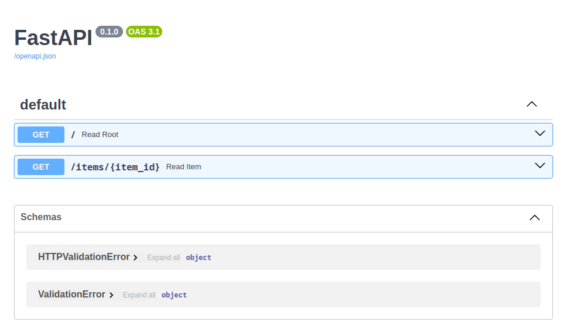

# fastapi

## About fastapi

Deploy a fastapi app to a free hosting such as Glitch or Vercel!

## Built With

+ python3
+ fastapi
+ uvicorn

## Getting Started

To get a local copy up and running follow these steps.

### Prerequisites

+ python3
+ pip3

### Installation

This template doesn't rely on any external dependencies or services.
1. clone the repo
```shell
https://github.com/kidistbedilu/fastapi.git && cd fastapi
```
2. create and activate virtual environment
```shell
virtualenv env && source env/bin/activate
```
3. install modules like fastapi uvicorn
```shell
pip install -r requirements.txt 
```

### Usage

run fastapi app at port `8080`
```shell
uvicorn main:app --host 0.0.0.0 --port 8080 --reload
```

fastapi-app screenshot.


[demo fastapi-app](https://trapezoidal-foregoing-spider.glitch.me/docs) powered by [Glitch](https://glitch.com/)  

## Roadmap

- [x] fastapi app
- [x] deploy to Glitch
- [ ] deploy to Vercel

> See the [open issues](https://github.com/kidistbedilu/fastapi/issues) for a full list of proposed features and known issues.

## Contributing

Any contributions you make are greatly appreciated. If you have a suggestion that would make this better, please fork the repo and create a pull request. Don't forget to give the project a star! Thanks again!!!

1. fork the project
2. create your feature branch `git checkout -b feature/amazing-feature`
3. commit your changes `git commit -m 'feat: add amazing feature'` use the [conventional-commit](https://www.conventionalcommits.org/en/v1.0.0/) specification
4. push to the branch `git push origin feature/amazing-feature`
5. open a pull request

## Contact

Kidist Bedilu | [kidistbedilu.com](kidistbedilu.com) | [me@kidistbedilu.com](me@kidistbedilu.com) | [@kidistbedilu](@kidistbedilu)

## License

Distributed under the [MIT License](https://opensource.org/license/mit/).
